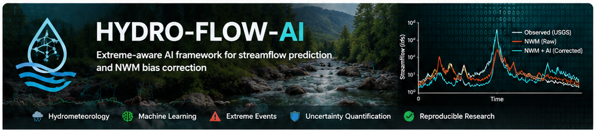
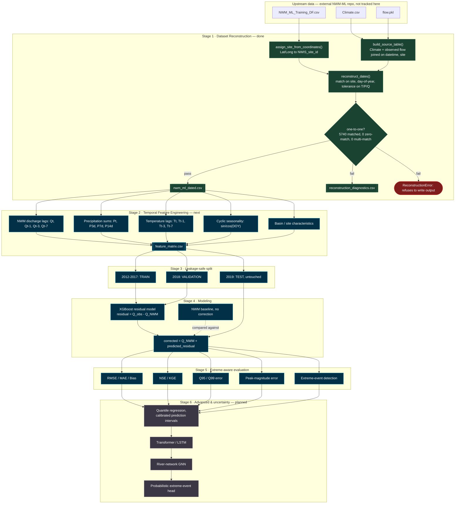

<p align="center">
  
</p>

<h1 align="center">HYDRO-FLOW-AI</h1>

<p align="center">
  <strong>Extreme-aware AI for streamflow prediction, National Water Model bias correction, uncertainty quantification, and flood-event detection.</strong>
</p>

<p align="center">
  <a href="https://github.com/mtariqi/HYDRO-FLOW-AI">
    
  </a>
  
  
  
  
  
</p>

<p align="center">
  <a href="https://github.com/mtariqi/HYDRO-FLOW-AI/stargazers">
    
  </a>
  <a href="https://github.com/mtariqi/HYDRO-FLOW-AI/network/members">
    
  </a>
  <a href="https://github.com/mtariqi/HYDRO-FLOW-AI/issues">
    
  </a>
  
  
  
</p>

# Why HYDRO-FLOW-AI?

National Water Model (NWM) forecasts are useful but can be systematically biased at individual gauges, and that bias can be especially consequential during high-flow and flood events. HYDRO-FLOW-AI treats bias correction as more than a generic regression task: the framework is explicitly designed to evaluate and improve performance in the tails of the streamflow distribution, not only average error under mostly normal conditions.

The current research baseline reconstructs a dated, site-aware training dataset and prepares a leakage-safe path toward temporal feature engineering, residual correction, extreme-event metrics, uncertainty quantification, and later spatiotemporal graph learning.

Study sites

Two USGS gauges are used in the current reconstruction workflow.

NWIS Site ID

USGS station

Latitude

Longitude

10133800

East Canyon Creek near Jeremy Ranch, UT

40.75966979

-111.5640912

10133600

McLeod Creek near Park City, UT

40.68803889

-111.5337194

Observed record: 1979–2023, daily. The current workflow combines observed USGS streamflow, temperature, precipitation, basin/site characteristics, and NWM flow. The dated reconstruction has been validated at 5,740 / 5,740 rows, with zero missing dates and zero duplicate (site, datetime) pairs.

End-to-end research pipeline


# PIPELINE LOGIC

**Extreme-aware AI framework for streamflow prediction and NWM bias correction**, built on hydrometeorological data, temporal feature engineering, machine learning, and uncertainty-aware flood-event detection.

## Motivation

National Water Model (NWM) forecasts are useful but systematically biased at individual gauges, and that bias is often worst exactly when it matters most — during high-flow and flood events. This project treats bias correction as more than a generic regression problem: the goal is a model that is explicitly evaluated on its ability to represent extremes, not just to minimize average error across mostly-normal conditions.

## Study sites

Two USGS gauges, matched to NWM grid cells by coordinates:

| NWIS Site ID | Latitude | Longitude |
|---|---:|---:|
| 10133800 | 40.75966979 | -111.5640912 |
| 10133600 | 40.68803889 | -111.5337194 |

Observed record: 2012–2019 (daily), climate forcing (temperature, precipitation) and observed USGS streamflow, joined against NWM output.

## Pipeline



**Legend:** green = complete and validated · blue = next / actively planned near-term · gray = longer-horizon roadmap · red = the validation-failure path (`ReconstructionError`, output withheld).

### 1. Dataset reconstruction (complete)

`src/hydro_flow_ai/reconstruct_dataset.py` recovers the `datetime` and `NWIS_site_id` fields that were dropped from the original ML training export (`NWM_ML_Training_DF.csv`), by:

1. Mapping each row back to its gauge using retained Lat/Long coordinates.
2. Rebuilding a dated source-of-truth table from `Climate.csv` + observed USGS flow (`flow.pkl`).
3. Restricting candidate dates to the same (site, day-of-year), then matching on temperature, precipitation, and flow using an absolute floating-point tolerance (`--match-atol`, default `1e-5`) rather than exact equality, to absorb floating-point noise introduced between the original export and the current source files.
4. Requiring every training row to match **exactly one** candidate date — the script refuses to write output otherwise, and writes a diagnostics CSV explaining any row that failed to match uniquely.

Status: verified end-to-end on both gauges — all 5,740 training rows (2,827 + 2,913) reconstruct to a unique date with zero ambiguous or missing matches.

```fish
python src/hydro_flow_ai/reconstruct_dataset.py
```

### 2. Temporal feature engineering (next)

Planned split — chosen specifically to avoid temporal leakage rather than a random split, since random splitting on time series data inflates apparent performance on extreme events:

- **2012–2017** → training
- **2018** → validation
- **2019** → held out, untouched test set

Planned initial feature set, restricted to variables actually available at prediction time (no future leakage):

- NWM discharge: `Q_t`, `Q_{t-1}`, `Q_{t-3}`, `Q_{t-7}`
- Precipitation: `P_t`, and rolling sums `P_3d`, `P_7d`, `P_14d`
- Temperature: `T_t`, `T_{t-1}`, `T_{t-3}`, `T_{t-7}`
- Basin/site characteristics
- Cyclic seasonality encoding (e.g. day-of-year as sin/cos)

### 3. Modeling and evaluation (planned)

Baseline model: XGBoost residual correction, where the model learns

```text
residual = observed_streamflow - NWM_streamflow
```

and the corrected forecast is

```text
corrected_streamflow = NWM_streamflow + predicted_residual
```

Evaluation deliberately goes beyond average-case accuracy:

- Standard: RMSE, MAE, Bias, NSE, KGE
- Extreme-focused: Q95/Q99 RMSE, peak-magnitude error, extreme-event detection performance

## Project structure

```text
HYDRO-FLOW-AI/
├── data/
│   ├── raw/
│   ├── interim/
│   ├── processed/
│   └── derived/
├── src/
│   └── hydro_flow_ai/
│       ├── __init__.py
│       └── reconstruct_dataset.py
├── tests/
├── configs/
├── notebooks/
├── models/
├── results/
│   ├── figures/
│   ├── tables/
│   └── metrics/
├── docs/
│   └── assets/
│       └── HYDRO-FLOW-AI-banner.png
├── README.md
├── pyproject.toml
├── requirements.txt
└── .gitignore
```

## Setup
### 4. Quick Start & Setup
1. Environment Setup
Clone the repository and set up a virtual environment:
```
git clone [https://github.com/your-username/HYDRO-FLOW-AI.git](https://github.com/your-username/HYDRO-FLOW-AI.git)
cd HYDRO-FLOW-AI

# Create virtual environment
python -m venv .venv

# Activate environment (bash/zsh)
source .venv/bin/activate

# Activate environment (fish)
# source .venv/bin/activate.fish

# Install dependencies
pip install -r requirements.txt
```fish
2. Run Reconstruction Pipeline
Execute Stage 1 data reconstruction:
python src/hydro_flow_ai/reconstruct_dataset.py

## Upstream reference

This project extends ideas and data-processing workflows from the Alabama Water Institute NWM-ML project. HYDRO-FLOW-AI is an independent research repository focused on extreme-flow bias correction, leakage-safe temporal modeling, uncertainty quantification, and future spatiotemporal graph learning.

## Status

- [x] Dataset reconstruction — datetime/site recovery, validated one-to-one (5,740/5,740 rows)
- [ ] Temporal feature engineering
- [ ] Leakage-safe train/validation/test split
- [ ] Baseline XGBoost residual-correction model
- [ ] Extreme-event evaluation suite (Q95/Q99, peak error, detection metrics)
- [ ] Uncertainty quantification using quantile regression and calibrated prediction intervals
- [ ] Transformer/LSTM temporal model
- [ ] River-network graph neural network
- [ ] Probabilistic extreme-event detection head
- [ ] Model comparison and ablation study
