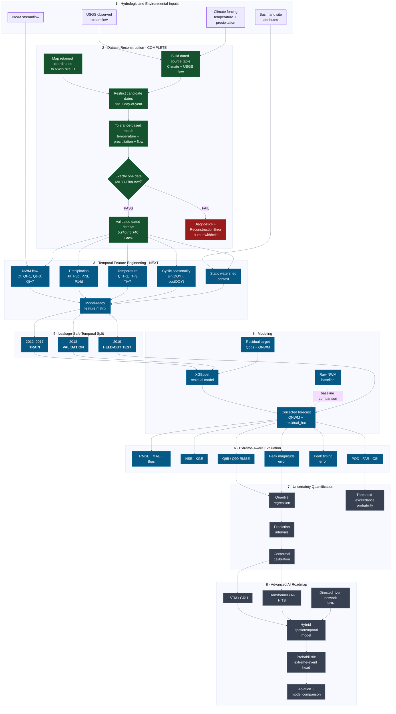
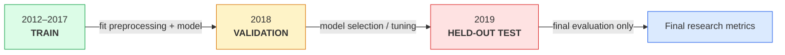
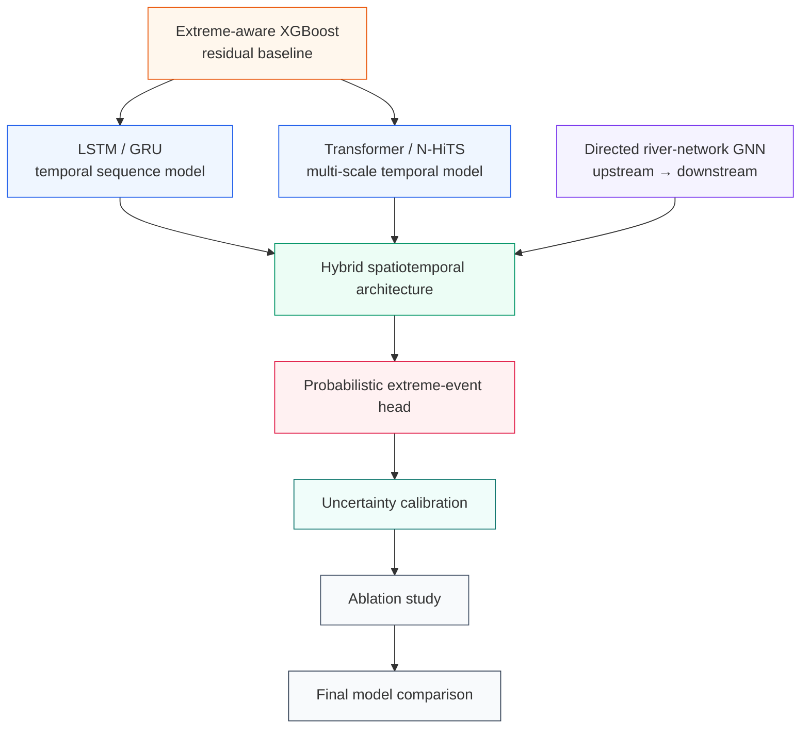

<p align="center">
  
</p>

<h1 align="center">HYDRO-FLOW-AI</h1>

<p align="center">
  <strong>
    Extreme-aware AI for streamflow prediction, National Water Model bias correction,
    uncertainty quantification, and flood-event detection.
  </strong>
</p>

<p align="center">
  <a href="https://github.com/mtariqi/HYDRO-FLOW-AI">
    
  </a>
  
  
  
  
  
</p>

<p align="center">
  <a href="https://github.com/mtariqi/HYDRO-FLOW-AI/stargazers">
    
  </a>
  <a href="https://github.com/mtariqi/HYDRO-FLOW-AI/network/members">
    
  </a>
  <a href="https://github.com/mtariqi/HYDRO-FLOW-AI/issues">
    
  </a>
  
  
  
</p>

---

## Why HYDRO-FLOW-AI?

National Water Model (NWM) forecasts provide an important hydrologic baseline, but local forecast errors can become substantial at individual gauges. Those errors are particularly important during high-flow and flood-related conditions, when underprediction or mistimed peaks can reduce the usefulness of operational forecasts.

HYDRO-FLOW-AI treats NWM bias correction as more than a conventional regression problem. The framework is designed to:

* preserve the NWM prediction as a physical/model baseline;
* learn systematic residual error from hydrometeorological context;
* represent antecedent rainfall, temperature, seasonality, and watershed characteristics;
* avoid temporal leakage during training and validation;
* evaluate high-flow behavior separately from average-flow performance;
* quantify predictive uncertainty;
* support future temporal deep learning and river-network graph learning.

The central research question is:

> **Can extreme-aware, temporally informed AI improve NWM streamflow predictions without sacrificing reproducibility, hydrologic interpretability, or out-of-sample validity?**

---


## Study sites

The current validated reconstruction uses two USGS gauges in Utah.

| NWIS Site ID | Station                                 |    Latitude |    Longitude |
| ------------ | --------------------------------------- | ----------: | -----------: |
| `10133800`   | East Canyon Creek near Jeremy Ranch, UT | 40.75966979 | -111.5640912 |
| `10133600`   | McLeod Creek near Park City, UT         | 40.68803889 | -111.5337194 |

### Current modeling record

The reconstructed machine-learning dataset spans **2012–2019 at daily resolution**.

The current workflow combines:

* observed USGS streamflow;
* NWM streamflow;
* temperature;
* precipitation;
* drainage area;
* basin elevation;
* forest/developed/impervious/herbaceous cover;
* steep-slope fraction;
* mean annual precipitation;
* seasonal timing information.

The validated reconstruction contains:

```text
Total rows              : 5,740
NWIS 10133600            : 2,827
NWIS 10133800            : 2,913
Missing dates            : 0
Duplicate site/date rows : 0
Ambiguous date matches   : 0
```

---

# Research pipeline


**Legend:**
🟢 complete and validated · 🔵 near-term implementation · ⚫ longer-term roadmap · 🔴 validation failure path

---

## Stage 1 — Dataset reconstruction ✅

The original ML export, `NWM_ML_Training_DF.csv`, retained hydrologic and environmental variables but removed `datetime` and `NWIS_site_id`.

`src/hydro_flow_ai/reconstruct_dataset.py` restores those fields reproducibly.

### Reconstruction logic

1. Assign each training row to an NWIS gauge using retained latitude/longitude.
2. Reconstruct a dated reference table from:

   * `Climate.csv`
   * observed USGS streamflow in `flow.pkl`
3. Restrict candidate dates to the same:

   * NWIS site;
   * day-of-year.
4. Match:

   * temperature;
   * precipitation;
   * observed streamflow.
5. Use an absolute numeric tolerance:

```text
--match-atol 1e-5
```

6. Require exactly **one** valid date for every original training row.
7. Reject zero-match or multi-match cases instead of silently guessing.
8. Validate uniqueness of `(NWIS_site_id, datetime)`.

### Validated result

```text
Original training rows : 5740
Unique matched rows    : 5740
Problem row IDs        : 0
Missing dates          : 0
Duplicate site/date    : 0
```

Run:

```fish
python src/hydro_flow_ai/reconstruct_dataset.py
```

---

## Stage 2 — Temporal feature engineering 🚧

The next stage converts the dated dataset into a leakage-safe temporal feature matrix.

### NWM flow features

```text
NWM_flow_t
NWM_flow_lag1
NWM_flow_lag3
NWM_flow_lag7
```

### Antecedent precipitation

```text
precip_1d
precip_3d
precip_7d
precip_14d
```

The multi-day precipitation features are intended to represent antecedent watershed forcing rather than only same-day rainfall.

### Temperature features

```text
temperature_t
temperature_lag1
temperature_lag3
temperature_lag7
```

### Seasonal encoding

Day-of-year is represented cyclically:

[
DOY_{\sin} =
\sin\left(\frac{2\pi,DOY}{365.25}\right)
]

[
DOY_{\cos} =
\cos\left(\frac{2\pi,DOY}{365.25}\right)
]

### Static watershed features

Current variables include:

* drainage area;
* mean basin elevation;
* percentage forest cover;
* percentage developed land;
* percentage impervious surface;
* percentage herbaceous cover;
* percentage steep slope;
* mean annual precipitation.

---

## Leakage-safe experiment design

A random split is intentionally avoided because adjacent daily observations are temporally autocorrelated.



This design protects the final reported performance from temporal leakage and repeated access to the test period.

---

## Stage 3 — Residual-correction baseline

The initial machine-learning baseline is **XGBoost residual correction**.

The target is:

[
e_t =
Q^{obs}_t - Q^{NWM}_t
]

The model learns:

[
\hat e_t = f_{\theta}(X_t)
]

The corrected prediction becomes:

[
\hat Q^{corrected}_t =
Q^{NWM}_t + \hat e_t
]

This preserves the NWM prediction as the reference hydrologic estimate while allowing ML to learn systematic local error.

---

# Extreme-aware evaluation

Average performance alone can conceal severe errors during rare high-flow events.

HYDRO-FLOW-AI therefore separates conventional metrics from extreme-flow metrics.

## Standard metrics

| Metric | Purpose                                                |
| ------ | ------------------------------------------------------ |
| RMSE   | penalizes large prediction errors                      |
| MAE    | average absolute prediction error                      |
| Bias   | systematic over- or underprediction                    |
| NSE    | hydrologic predictive efficiency                       |
| KGE    | combined correlation, variability, and bias assessment |

## Extreme-focused metrics

| Metric               | Purpose                                        |
| -------------------- | ---------------------------------------------- |
| Q95 RMSE             | error above the 95th-percentile flow threshold |
| Q99 RMSE             | error in the most extreme tail                 |
| Peak magnitude error | accuracy of maximum discharge                  |
| Peak timing error    | timing displacement of observed peaks          |
| POD                  | probability of detection                       |
| FAR                  | false-alarm ratio                              |
| CSI                  | critical success index                         |
| Precision / Recall   | class-imbalance-aware event detection          |

---

# Uncertainty quantification

Future deterministic predictions will be extended with uncertainty-aware outputs.

Planned methods include:

* quantile regression;
* calibrated prediction intervals;
* conformal prediction;
* interval coverage;
* interval sharpness;
* reliability analysis;
* probability of threshold exceedance.

The eventual extreme-event prediction target is:

[
P(Q_{t+h} > Q_{critical})
]

rather than only a single deterministic discharge value.

---

# Advanced AI roadmap



---

# Repository structure

```text
Google Drive — collaborative/source data
        │
        ├── NWM data
        ├── USGS streamflow
        ├── climate data
        ├── site/basin data
        └── collaborator-provided datasets
                │
                ▼
Local HYDRO-FLOW-AI/data/
        │
        ├── raw/          ← downloaded source data
        ├── interim/      ← intermediate transformations
        ├── processed/    ← cleaned datasets
        └── derived/      ← ML-ready datasets
                │
                ▼
GitHub — code + documentation only
```
# Data Sources

HYDRO-FLOW-AI integrates hydrologic, meteorological, and watershed
information from multiple sources.

## Data provenance

| Source | Data | Role |
|---|---|---|
| USGS NWIS | Observed streamflow | Ground-truth discharge |
| National Water Model (NWM) | Simulated streamflow | Baseline/model input |
| Climate forcing | Temperature and precipitation | Meteorological predictors |
| Basin/site attributes | Watershed characteristics | Static predictors |
| Collaborative research data | Project-specific hydrologic datasets | Model development and validation |

## Collaborative data

Additional project datasets are maintained in a shared Google Drive
workspace used by the research collaborators.

These source datasets are intentionally excluded from the public GitHub
repository. The repository contains the processing, reconstruction,
feature-engineering, modeling, and evaluation code required for the
HYDRO-FLOW-AI workflow.

## Current study sites

- USGS NWIS 10133800
- USGS NWIS 10133600

Study period: 2012–2019.
---

# Quick start

## 1. Clone the repository

```bash
git clone https://github.com/mtariqi/HYDRO-FLOW-AI.git
cd HYDRO-FLOW-AI
```

## 2. Create a virtual environment

### Bash / Zsh

```bash
python3 -m venv .venv
source .venv/bin/activate
```

### Fish

```fish
python3 -m venv .venv
source .venv/bin/activate.fish
```

## 3. Install dependencies

```bash
python -m pip install --upgrade pip
pip install -r requirements.txt
```

## 4. Add source data locally

Large source and derived datasets are intentionally excluded from Git.

Place or link the required input files according to the local project configuration before running the reconstruction pipeline.

## 5. Run dataset reconstruction

```bash
python src/hydro_flow_ai/reconstruct_dataset.py
```

Expected validation:

```text
Original training rows : 5740
Unique matched rows    : 5740
Problem row IDs        : 0
```

---

# Reproducibility principles

HYDRO-FLOW-AI follows several methodological constraints:

* no random temporal split for the primary experiment;
* no future information in predictor construction;
* an untouched final test period;
* standard and extreme-flow metrics reported separately;
* failed reconstruction is explicit rather than silently corrected;
* derived datasets are reproducibly generated;
* large data and model artifacts remain outside source control;
* raw NWM performance is retained as a comparison baseline;
* feature and architecture additions are evaluated using ablation studies;
* uncertainty calibration is treated separately from point-prediction accuracy.

---

# Data management

Large hydrologic inputs and derived datasets are not stored directly in the GitHub repository.

The repository tracks:

* source code;
* configuration;
* documentation;
* reproducible processing logic;
* tests;
* lightweight research outputs.

Data directories are retained structurally with `.gitkeep` files while substantive datasets remain gitignored.

---

# Collaborator

**Mohammad Shahabul Alam, PhD**
Assistant Professor, University of West Florida

* GitHub: [shahab122](https://github.com/shahab122)
* LinkedIn: [Mohammad Shahabul Alam](https://www.linkedin.com/in/md-shahabul-alam/)

---

# Upstream reference

This project extends ideas and data-processing workflows from the Alabama Water Institute **NWM-ML** project.

HYDRO-FLOW-AI is maintained as an independent research repository focused on:

* extreme-flow NWM bias correction;
* leakage-safe temporal modeling;
* extreme-event evaluation;
* uncertainty quantification;
* probabilistic threshold prediction;
* temporal deep learning;
* future river-network graph learning.

Where upstream code, data-processing workflows, or methodological components are reused or adapted, the original project should be appropriately acknowledged and cited.

---

# Project status

| Component                                | Status     |
| ---------------------------------------- | ---------- |
| Repository architecture                  | ✅ Complete |
| Dataset reconstruction                   | ✅ Complete |
| 5,740-row one-to-one date validation     | ✅ Complete |
| Site/date duplicate validation           | ✅ Complete |
| Temporal feature engineering             | 🚧 Next    |
| Leakage-safe train/validation/test split | ⏳ Planned  |
| Raw NWM benchmark                        | ⏳ Planned  |
| XGBoost residual-correction baseline     | ⏳ Planned  |
| Standard hydrologic metrics              | ⏳ Planned  |
| Q95/Q99 extreme-event evaluation         | ⏳ Planned  |
| Peak magnitude / timing evaluation       | ⏳ Planned  |
| Quantile uncertainty estimation          | ⏳ Planned  |
| Conformal calibration                    | ⏳ Planned  |
| LSTM / Transformer modeling              | ⏳ Planned  |
| River-network GNN                        | ⏳ Planned  |
| Probabilistic extreme-event head         | ⏳ Planned  |
| Model ablation study                     | ⏳ Planned  |

---

# Technology stack

<p>
  
  
  
  
  
  
  
  
</p>

---

# Citation

A formal software citation and versioned release will be added when the first stable research release is published.

Until then, please cite:

```text
HYDRO-FLOW-AI
https://github.com/mtariqi/HYDRO-FLOW-AI
```

and acknowledge the upstream NWM-ML project when its workflows or source components materially contribute to the analysis.

---

# Contributing

Reproducibility checks, hydrology-domain feedback, feature suggestions, model comparisons, and issue reports are welcome.

For substantial changes, please open an issue describing:

1. the hydrologic or machine-learning problem;
2. the proposed change;
3. expected validation criteria;
4. implications for temporal leakage;
5. implications for extreme-event evaluation;
6. implications for uncertainty or calibration.

---

<p align="center">
  <strong>HYDRO-FLOW-AI</strong><br>
  Better average predictions are useful.<br>
  <strong>Better extreme-event predictions are the objective.</strong>
</p>
